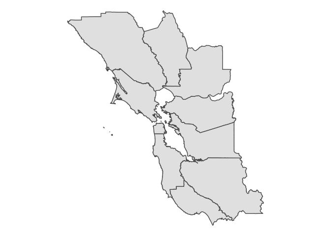

<!-- README.md is generated from README.Rmd. Please edit that file -->

# iGIScData

<!-- badges: start -->

<!-- badges: end -->

The goal of iGIScData is to furnish GEOG 604/704 students with a variety
of datasets.

## Installation

You can install the released version of iGIScData from GitHub with:

``` r
# install.packages("remotes")
remotes::install_github("iGISc/iGIScData")
```

The accompanying datasets are ‘lazily’ loaded into your global
environment.

## Examples

``` r
library(iGIScData)
library(ggplot2)

ggplot() +
  geom_sf(data = BayAreaCounties) +
  theme_void()
```


